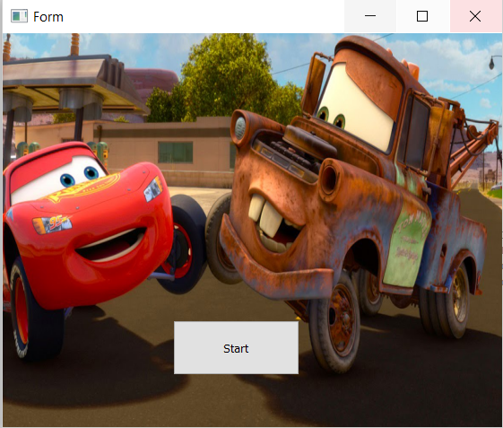
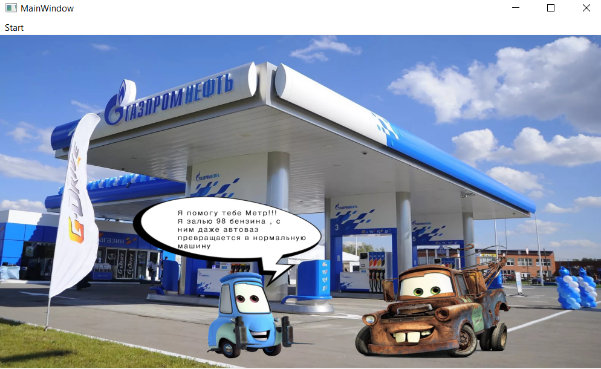
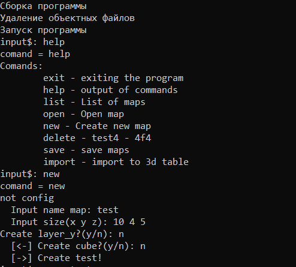

# Neidorf

## Образование
- Законченное среднее образование - Технический лицей при СГУГиТ
- В процессе получения высшего образования - 2 курс СибГУТИ

## Список навыков в области программирования
- ✨C✨
- python
- html, css, js

## Пример работ

- Мультик, сделанный в Qtcreator

- Структура управления нереляционными базами данных

